编写存证服务体验步骤（以下是蚂蚁链的存证服务说明）
区块链应用DAPP（Decentralized Application）就是去中心化应用。DAPP就是基于P2P对等网络而运行在智能合约之上的分布式应用程序，区块链则为其提供可信的数据记录。在开发者实验专区，我们为您提供了两种区块链应用供您进行交互式体验：

- 小文件存证体验

- 大文件存证体验

**小文件存证体验**

1、登录 控制台，单击 产品与服务 > 蚂蚁区块链BaaS平台 进入 BaaS 平台，单击页面上方 区块链实验室，进入 BaaS区块链实验室 引导页。

2、下拉页面至开发者实验专区模块，单击区块链应用子模块左侧小文件存证应用卡片上的 交互式体验，即可进行小文件存证的体验。

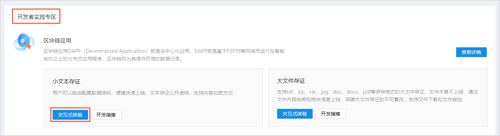

1. 说明
   - 说明：有关小文件存证的方案介绍，可以单击该卡片上的开发指南，学习该应用的整个开发流程。

2. 小文件数据录入。
   - 在区块链存证列表 右侧，选择 加密存证 或 非加密存证 的方式进行数据录入。
   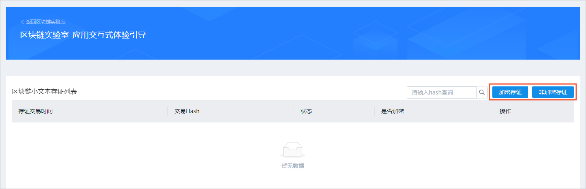

1. 在弹框中输入存证内容。
    - 示范案例
    
    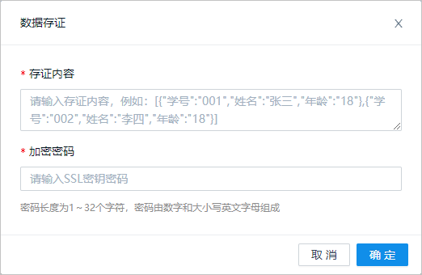
    
    |参数|说明|
    |:---|:---|
    |存证内容|请在此录入您需要进行存证的数据，数据存量限制在10240个字符以内。|
    |加密密码|只有选择 加密存证 时，需要设置 加密密码。后续查看存证内容时需要输入此处设置的密码才能展示明文展示。|

3. 在区块链存证列表下，可以查看每条记录的链上存证内容和链上hash值。单击列表中 操作 栏下的 查看详情，可以查看存证内容。
    - 非加密存证的方式，可直接明文展示存证内容。
    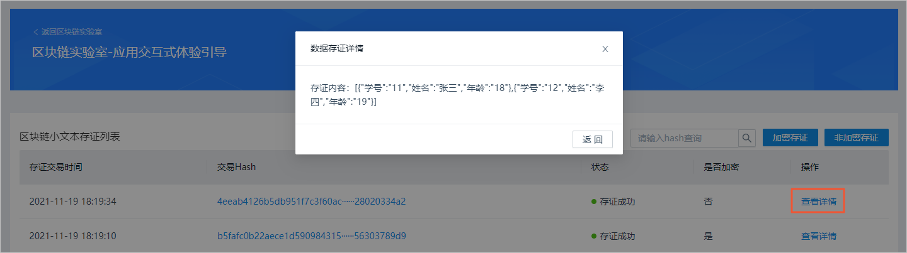
    - 加密存证的方式，则默认展示密文，您需要输入存证时设置的密码后，才能明文展示。
    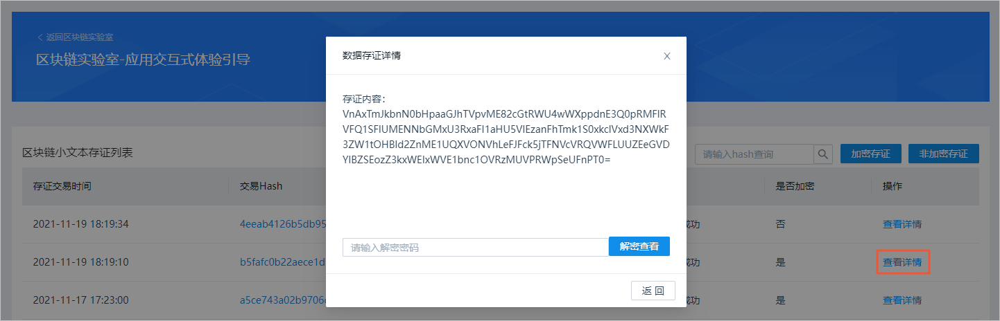
    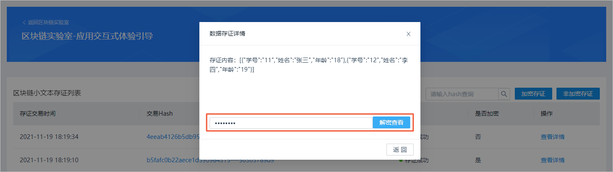
    
**大文件存证体验**

1. 登录控制台，单击 产品与服务 > 蚂蚁区块链BaaS平台 进入 BaaS 平台，单击页面上方 区块链实验室，进入 BaaS区块链实验室 引导页。
    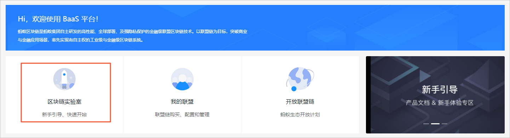

2. 下拉页面至开发者实验专区模块，单击区块链应用子模块右侧大文件存证应用卡片上的 交互式体验，即可进行大文件存证的体验。
    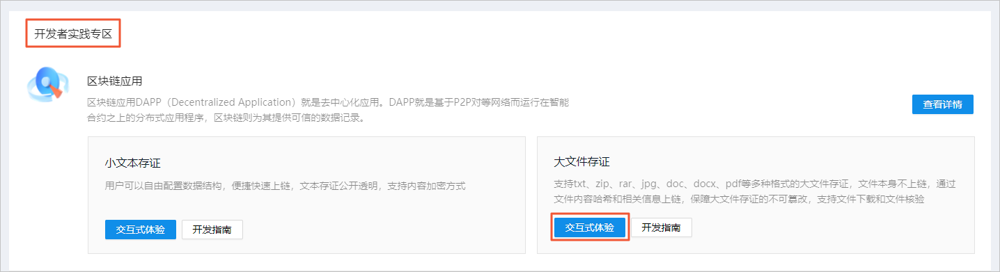

    说明

    说明：有关大文件存证的方案介绍，可以单击该卡片上的开发指南，学习该应用的整个开发流程。

3. 大文件上传。

    i. 在 区块链存证列表 右侧，单击 存证 即可进行大文件上链的操作。
    
    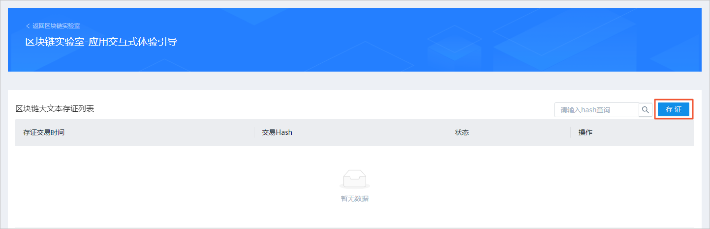
    
    ii. 在弹框中选择本地文件进行上传。
    
    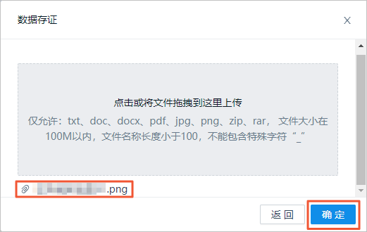
    
    说明
    
    说明：上传的文件仅允许是txt、doc、docx、pdf、jpg、png、zip、rar格式，文件大小限制在1M~100M之间，文件名称长度小于100，且不能包含下划线（_）。

4. 单击弹框中的 确定 ，即可在列表下展示一条存证记录。
    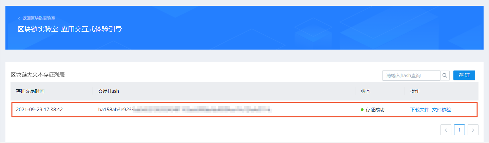

5. 在 区块链存证列表 下，可以对每条记录进行文件下载、文件核验、链上hash值的查看。
    - 单击列表中 操作 栏下的 下载文件，可以下载链上的存证文件。
    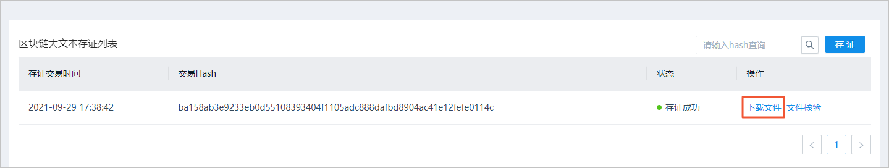

    说明 
    注意：大文件存证最多支持最新5个记录的下载功能，超过5条将不提供下载能力。

    - 单击列表中 操作 栏下的 文件核验，可以对链上的存证文件进行校验。
    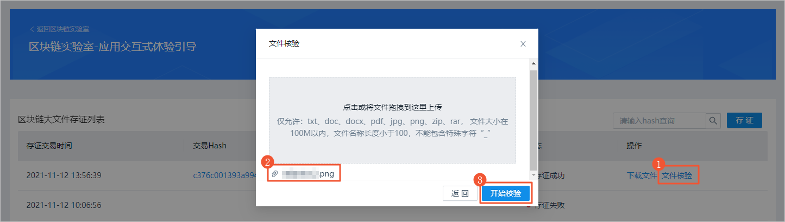

    在 文件核验 弹窗中，上传本地文件进行核验。

    - 如果核验成功，展示如下。

    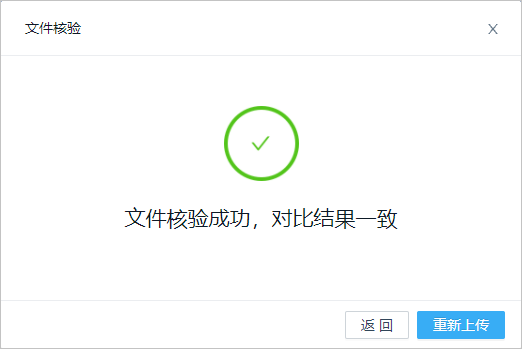

    - 如果核验失败，展示如下。
    
    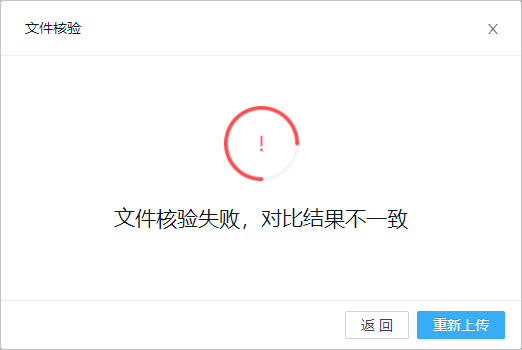

### 快速入门

**1. 存证列表**
在用户主页选择业务应用-存证，即可进入存证主页，可以看到所有用户的存证：

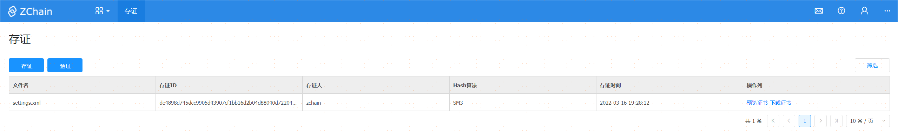

**2. 存证**
选择存证，上传需要存证的文件，选择确定即可进行存证上链：

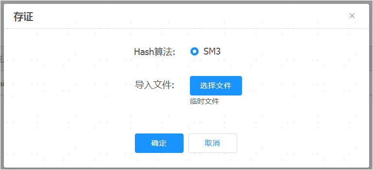

**3. 验证**

选择验证，上传需要验证的文件，选择确定进行验证：

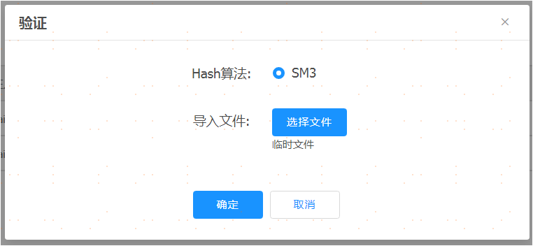

3.1. 验证成功
验证成功时提示文件已存证

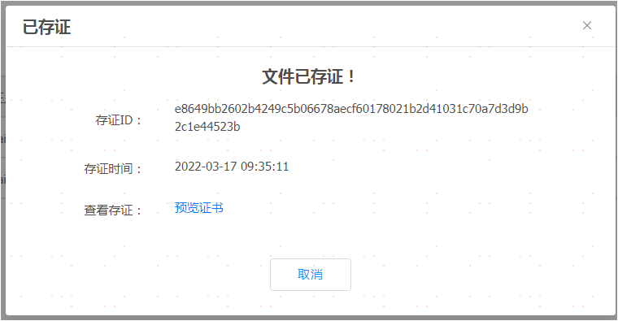

3.2. 验证失败
验证失败时提示文件未存证

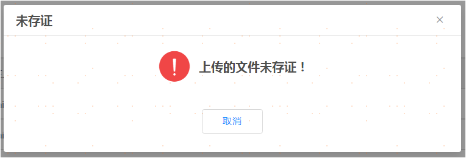

**4. 存证证书**
已存证的文件会生成存证证书，可以查看和下载证书：

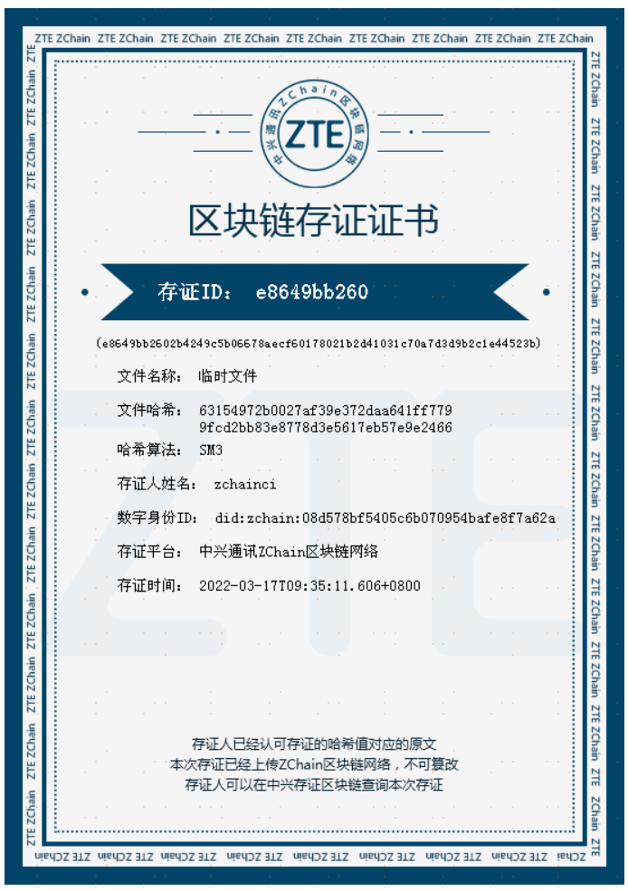

### 功能说明
存证服务提供文件存证和文件验证功能

**1. 存证**

存证时会将文件内容hash上链，并列出已存证的文件列表

**2. 验证**

提供文件验证功能，会将上传的文件与已存证的文件内容对比，相同则成功，不相同则失败

**3. 存证证书**

已存证的文件自动生成证书，可以查看和下载证书

### 解决方案

描述存证服务解决方案，涉及到架构、流程.......

### 应用场景

场景1：区块链电子印章

区块链电子印章可贯穿政务服务、以及商业活动的各个环节。与传统电子印章相比，基于区块链技术的电子印章在安全性方面更胜一筹。区块链电子印章从发起签署到结束，全流程上链，可监控追踪用印的每一个环节，可便捷、准确地验证印章文件及印章的真伪，大大提升印章管理与使用的便捷性、安全性。可随时随地线上操作、快捷便利、突破地域限制、签署成本低，符合政府、企业等单位或机构降本提效要求，并在节能减排方面发挥巨大价值，成为数字经济的助推器。

(1). 行业痛点

第一，如果突破地域限制受理政务申请，异地申请人和材料的真实性无法查验。

第二，数据壁垒，涉及人社、医保等使用专网的事项，必须在部门的专网上办理，而系统在各地未打通。

第三，各地审批事项的名称、所需材料、办理时限流程等都不同，开展跨省通办，须重新确定符合两地各自需求的统一服务标准，极为费时费力。

(2). 方案架构  
政务区块链通过把可靠成熟的电子印章技术与区块链技术深度融合，不仅可以提供专业可靠的区块链电子印章服务，还可以为政府跨地区、跨部门和跨层级的数据交换和信息共享提供有力的技术保障，助力打通政务服务“全网办”、“一网通办”，加速数字政府的建设，提升政务数字化服务能力。